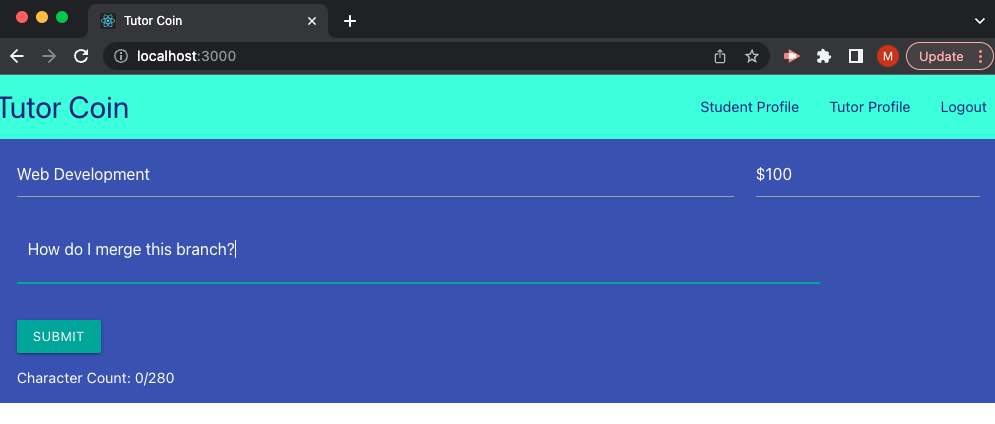
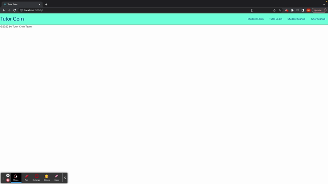

# Tutor Coin

## Purpose
Showcase collaborative skills and coding abilities, especially in the context of a scalable, user-focused MERN app.

## Table of Contents
- [Purpose](#purpose) 
- [Description](#description) 
- [Process](#process)
- [Installation Instructions](#installation-instructions)
- [Future Development](#future-development)
- [Presentation Link](#presentation-link) 
- [Heroku Deployed](#heroku-deployed)
- [Demo Video Link](#demo-video-link)
- [Github Repository](#github-repository)

## Description
As a busy student with challenging assignments
When I need help with an assignment 
Then I can make a money offer to a tutor to help me to get the job done
When student goes to post a job they can offer a price 
Then tutors can view the job posting and email the student to accept offer

## 

## Process 
Technology used: 
- MongoDB
- GraphQL
- Express
- React
- Node.js
- Queries and Mutations
- JWT
- HTML, CSS, Javascript
- Materialize

Contributions:
- Jordan, Front End
- Michael, Back End
- Ghulam, Back End
- Diego, Back End
- Macy, Front End

## Installation Instructions
Clone the repo to your local machine, and then install the dependencies with npm install. Once fully installed, you can run the app from the root directory via the package.json script or using npm commands. This will pull up the website on Localhost 3000. Or you can click the Heroku Deployed Link instead. 

## Future Development 
- Include Stripe or payment platform
- Include user communication on app 

## Presentation Link
https://docs.google.com/presentation/d/1V19s6clrn8KaRnX-QMSdG8X2AKKs_ZRz-QsJxjn-VM8/edit?usp=sharing

## Heroku Deployed

## Demo Video Link
https://drive.google.com/file/d/1H7J2jvk1cwdFA5ySXfhYoRXdC2zGMnWa/view

## Github Repository
https://github.com/mpeterson56/Tutor-Coin

## Made with ❤️️  by Macy Mannix, Ghulam Zaka, Jordan Thomas, Diego Rivera and Michael Peterson
Mentored by UC Davis Full Stack Web Developer Bootcamp
This project was bootstrapped with [Create React App](https://github.com/facebook/create-react-app).